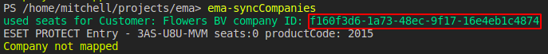
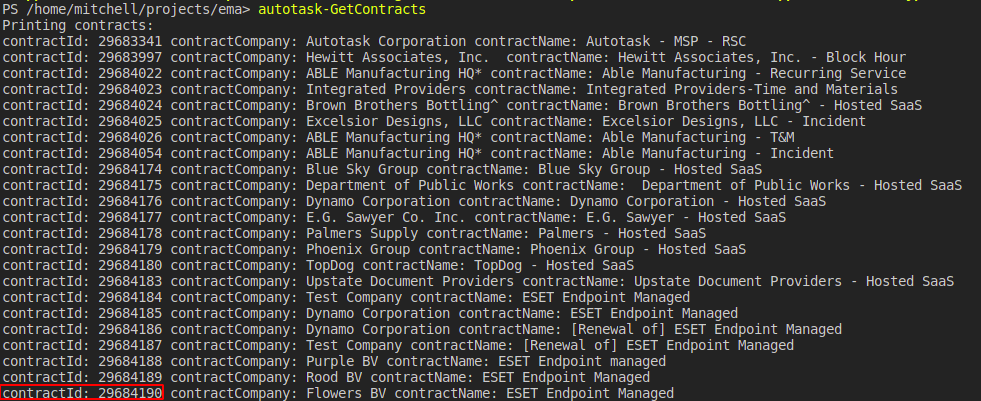
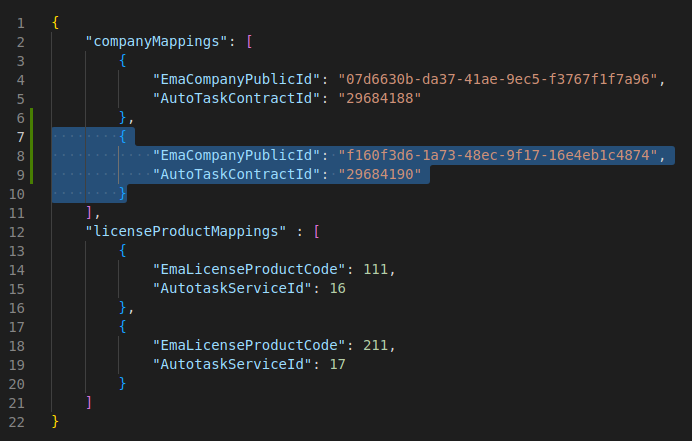
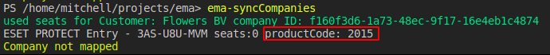
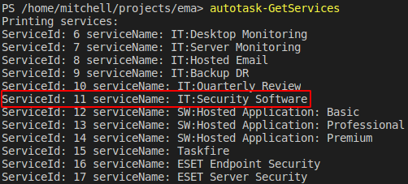
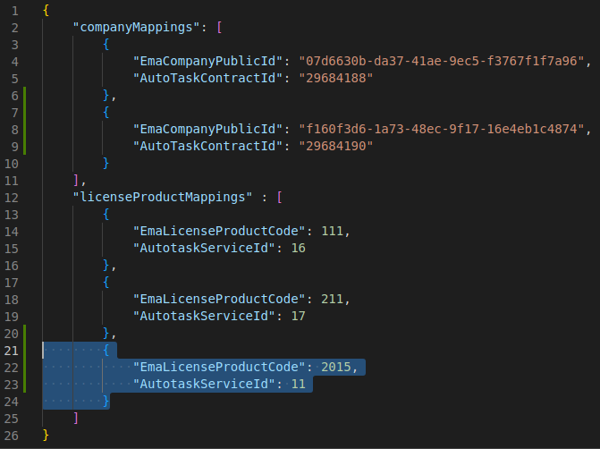
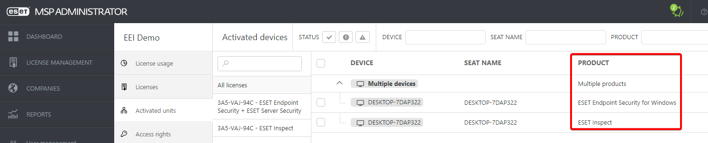
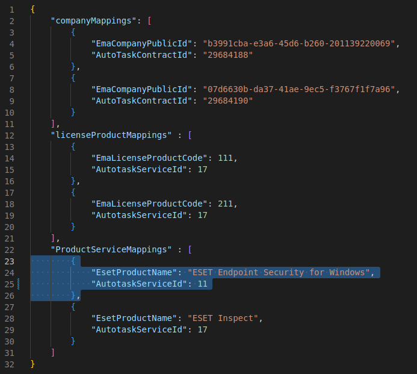

# Howto: Creating mappings

**Before you can create mappings, please make sure you meet the following pre-requisites:**
1. Companies need to have an active contract in Autotask PSA
2. Contracts should have atleast one (mapped) Service Item, the script will only create adjustments to existing service items, it will not add or remove them. 

## Mapping EMA Companies to Autotask PSA Contracts
**Step 1: Getting the EmaCompanyPublicId**
1. Run Invoke-EmaSyncCompanies
2. Find the emaCompanyPublicId of the company you want to map:

3. in our case it is: f160f3d6-1a73-48ec-9f17-16e4eb1c4874

**Step 2: Getting the autotaskContractId**
1. Run Get-autotaskContracts
2. find the contractId of the contract we want to map:

3. in our case it is: 29684190

**Step 3: Creating the mapping**
1. open mappings.json and use the information from previous steps to create the mapping
2. Example (highlighted lines were added): 

## Mapping EMA License Types to Autotask Services
**Step 1: Getting the EmaLicenseProductCode**
1. run Invoke-EmaSyncCompanies
2. Find the EmaLicenseProductCode for the license you want to map:

3. in our case it is 2015

**Step 2: Getting the AutotaskServiceId**
1. run Get-autotaskServices
2. find the AutotaskServiceId for the service you want to map:

3. in our case it is 11

**Step 3: Creating the mapping**
1. open mappings.json and use the information from previous steps to create the mapping
2. Example (highlighted lines were added)

## Mapping EMA Activated ProductName to Autotask Services

note: this is only used for Invoke-EmaSyncCompaniesExperimental
**Step 1: Getting the EsetProductName**
1. Log into ESET MSP Administrator
2. Open a company
3. Go to "Activated Units"
4. Find the relevant ProductName(s) that you want to map: 

3. in our case it is "ESET Endpoint Security for Windows"

**Step 2: Getting the AutotaskServiceId**
1. run Get-autotaskServices
2. find the AutotaskServiceId for the service you want to map:

3. in our case it is 11

**Step 3: Creating the mapping**
1. open mappings.json and use the information from previous steps to create the mapping
2. Example (highlighted lines were added)

