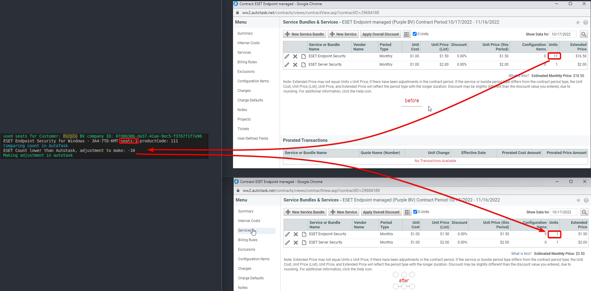

# Powershell script for syncing EMA License usage to Autotask PSA Contracts
No longer needed because of: https://help.eset.com/psa_plugin/en-US/

Script aims to provide the billing functionality of https://www.eset.com/int/business/partner/integration/download-autotask-plugin/ for customers using ESET PROTECT Cloud

**Tested with Powershell 7.2.6+**

- Note: this script connects to the Autotask pre-release server (webservices2.autotask.net) change the url's if needed. (see https://www.autotask.net/help/developerhelp/Content/APIs/General/API_Zones.htm)
- Note2: Expiremental, use at own risk

**You will have to set up mappings in order to sync data between EMA and Autotask PSA**

to get the relevant information to create mappings you can use: 

- Get-autotaskContracts - to get contractId's 
- Get-autotaskServices - to get ServiceId's
- Invoke-EmaSyncCompanies - to get companyPublicId and LicenseProductCode

See mappings.json for example. More detailed instructions can be found in [mappings.md](mappings.md)

once mappings are set-up running Invoke-EmaSyncCompanies will sync data to Autotask PSA.
see sync.ps1 for example on how to run/configure needed variables

If you want to use mapping based on Activated device product name instead of license type (this allows you to map individual products within a bundle license to different services e.g. ESET Server Security to service X and ESET Endpoint Security to Service Y)
use Invoke-EmaSyncCompaniesExperimental instead of Invoke-EmaSyncCompanies

script in action: 

